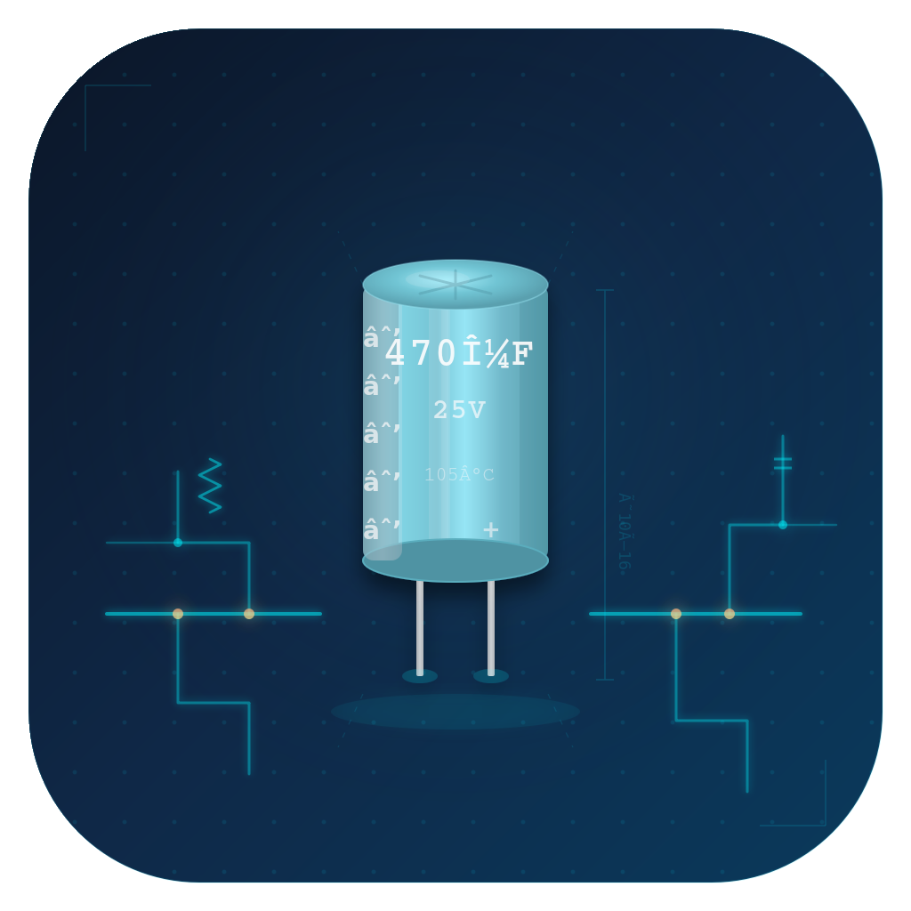

<p align="center">
  
</p>

<h1 align="center">3D Schematic Modeler</h1>

A macOS application that transforms circuit schematic images into interactive 3D models using Claude's vision API. Built for electronics repair technicians and hobbyists working with vintage audio equipment and other analog circuits.

  

## Features

### Schematic-to-3D Pipeline

- **Claude Vision Analysis** — Import a schematic image (PNG/JPG) and Claude extracts the full netlist: components, pin connections, nets, and functional blocks
- **Parametric 3D Rendering** — Components rendered as realistic geometry: resistors with color bands, electrolytic capacitors, transistors, DIP/SOIC ICs, transformers, diodes, and more
- **PCB-Style Trace Routing** — Nets rendered as color-coded wire traces with L-shaped routing and multi-layer stacking to avoid visual clutter

### Service Manual Integration

- **Manual Library Browser** — Scans `~/Claude-Manuals/` for organized service manuals with `_index.md` metadata
- **Multi-Page Assembly Analysis** — Analyzes multiple schematic pages and enriches with parts list data for complete circuit extraction
- **In-App Image Viewer** — Gallery view for schematic pages and parts lists with zoom, pan, and keyboard navigation
- **Circuit Caching** — Analyzed circuits cached locally as JSON so repeat loads are instant

### Interactive 3D Visualization

- **Orbit Camera** — Scroll to zoom, drag to rotate the 3D board
- **Click-to-Select** — Click any component in the 3D view to inspect it
- **Net Highlighting** — Selected components highlight all connected traces (VCC=red, GND=black, VEE=blue)
- **Functional Block Focus** — Click a block label to highlight its components and animate the camera to that section of the board
- **Component Inspector** — Right sidebar shows designator, value, package, pins, connected nets, and repair annotations

### Diagnostic & Repair Tools

- **Failure Heat Map** — Claude assesses per-component failure probability; the 3D view color-codes components green (safe) through red (likely failed). Electrolytics and power transistors in vintage gear score highest
- **Voltage Overlay** — Floating labels show expected DC voltages at key nodes throughout the circuit
- **Guided Troubleshooting** — Interactive step-by-step diagnostics: describe a symptom, and Claude walks you through test points with expected measurements. The 3D view highlights each component as you go
- **Component Annotations** — Add repair notes to individual components (e.g., "replaced 2024-01", "measures 52uF, spec is 47uF")

### API Usage Tracking

- **Session Cost Display** — Toolbar shows cumulative API cost for the session
- **Token Breakdown** — Hover for input/output token counts and request count
- **Settings Panel** — View and reset usage; estimated cost based on Claude Sonnet pricing ($3/M input, $15/M output)

## Technology

| Layer | Technology |
|-------|-----------|
| UI | SwiftUI (macOS 14+) |
| 3D Rendering | SceneKit |
| AI Integration | Claude API (claude-sonnet-4-20250514) |
| Concurrency | Swift actors, @MainActor, async/await |
| State Management | @Observable (Swift 5.9+) |
| Build System | Swift Package Manager |
| Dependencies | None (Apple frameworks only) |

## Project Structure

```
Sources/SchematicModeler/
├── App.swift                          # Entry point, menus, settings
├── Models/
│   ├── Circuit.swift                  # Component, Net, Pin, FunctionalBlock, TroubleshootStep
│   ├── DemoCircuits.swift             # Pioneer SX-750 power amp demo
│   └── ServiceManual.swift            # Manual/assembly metadata
├── Views/
│   ├── ContentView.swift              # Main 3-column layout + toolbar
│   ├── SceneKitView.swift             # NSViewRepresentable 3D viewport
│   ├── CircuitExplanationView.swift   # Bottom panel, block legend
│   ├── ComponentDetailView.swift      # Right sidebar inspector
│   ├── ComponentListView.swift        # Left sidebar component list
│   ├── GuidedTroubleshootView.swift   # Step-by-step diagnostics panel
│   ├── SchematicImageViewer.swift     # Image gallery with zoom
│   ├── SchematicImportView.swift      # Image import sheet
│   ├── AssemblyListSidebar.swift      # Assembly browser with context menu
│   ├── AssemblyBrowserView.swift      # Assembly detail view
│   ├── ManualBrowserView.swift        # Service manual browser
│   └── SchematicPreviewView.swift     # Schematic preview + analysis
├── ViewModels/
│   ├── CircuitViewModel.swift         # Circuit state, selection, overlays
│   └── ManualBrowserViewModel.swift   # Manual library state, analysis orchestration
├── Services/
│   ├── ClaudeAPIService.swift         # All Claude API calls, image preprocessing, JSON repair
│   ├── APIUsageTracker.swift          # Token counting and cost estimation
│   ├── CircuitCacheService.swift      # Local JSON circuit cache
│   ├── ManualLibraryService.swift     # ~/Claude-Manuals/ directory scanner
│   └── ManualSearchService.swift      # External manual search integration
├── Rendering/
│   ├── SceneBuilder.swift             # 3D scene orchestration, heat map, voltage overlay
│   ├── ComponentGeometry.swift        # Parametric 3D shapes for each component type
│   └── WireRenderer.swift             # PCB trace routing and rendering
└── Resources/
    └── AppIcon.png
```

## Getting Started

### Requirements

- macOS 14 (Sonoma) or later
- Swift 6.0 toolchain
- Anthropic API key ([console.anthropic.com](https://console.anthropic.com))

### Build & Run

```bash
git clone <repo-url>
cd 3d-schematic-modeler
swift build
swift run
```

### Configuration

1. **Set your API key** — Open Settings (Cmd+,) and enter your Anthropic API key
2. **Load the demo** — Click the CPU icon in the toolbar to load the Pioneer SX-750 Power Amp demo circuit
3. **Import your own** — Click the photo icon to analyze a schematic image

### Service Manual Library (Optional)

Organize service manuals in `~/Claude-Manuals/`:

```
~/Claude-Manuals/
└── Pioneer_SX-750/
    ├── _index.md          # Manual metadata and assembly list
    ├── schematic-1.png    # Schematic page images
    ├── schematic-2.png
    └── parts-list.png
```

The `_index.md` file maps assemblies to their schematic and parts list images for multi-page analysis.

## Keyboard Shortcuts

| Shortcut | Action |
|----------|--------|
| Cmd+O | Import schematic image |
| Cmd+Shift+D | Load demo circuit |
| Cmd+Shift+I | Toggle inspector |
| Cmd+Shift+M | Browse service manuals |
| Cmd+, | Settings |

## How It Works

1. **Image Analysis** — Schematic images are preprocessed (max 1200px, JPEG compressed) and sent to Claude with a structured system prompt requesting JSON netlist output
2. **JSON Extraction** — Claude returns components, pins, nets, functional blocks, and layout positions. A repair algorithm handles truncated responses by tracking JSON depth and closing open structures
3. **3D Construction** — `SceneBuilder` creates a SceneKit scene with a PCB ground plane, instantiates parametric geometry for each component, and routes wire traces using minimum spanning tree pathfinding
4. **Interactive Exploration** — Hit testing maps 3D clicks to component designators. Selection propagates through the view model to highlight connected nets and update the inspector
5. **AI Diagnostics** — Heat map, voltage overlay, and guided troubleshooting each make targeted Claude API calls with the circuit context, then render results back into the 3D scene

## License

MIT
